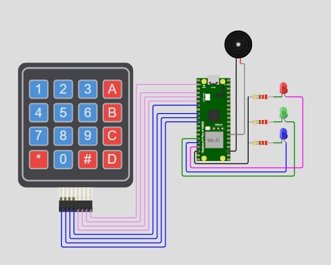

# **Atividade 1 (Obrigatória): Controle de pinos GPIO com o uso de um teclado matricial**

## **Líder da Equipe**
**Hugo S. Dias**

### Funções definidas:
- Gestão do repositório no GitHub.
- Revisão e aprovação de pull requests.
- Garantia de que todas as tarefas sejam concluídas dentro do prazo.
- Criação e manutenção do arquivo README.md, incluindo instruções detalhadas.
- Organização do vídeo ensaio final e envio do link para o repositório.

---
# Video de apresentação deste projeto

[Video de apresentação deste projeto](https://drive.google.com/file/d/1aoHDodgtcem5vyiYCWFKmKKA3Xvj7X4c/view?usp=sharing "Video de apresentação deste projeto")


## **Colaboradores e Divisão das Tarefas**

1. **Configuração e integração do teclado matricial** - Jackson Silva
2. **Controle do LED RGB 1** - Alinne de Souza
3. **Controle do LED RGB 2** - Gabriel Santos
4. **Controle do LED RGB 3** - João Vitor 
5. **Controle do buzzer** - Sérgio Emílio
6. **Testes e validação de cada componente** - Vinícius Kauan
7. **Documentação inicial do `README.md`, instruções e detalhes básicos** - Arthur Alencar

## **Simulador online**

[Projeto no Simulador WOKWI](https://wokwi.com/projects/420095379931354113 "Projeto no Simulador WOKWI")

## Descrição Geral

Este projeto utiliza um teclado matricial 4x4 conectado a um Raspberry Pi Pico para controlar três LEDs (vermelho, verde e azul) de forma interativa. Ao pressionar uma tecla específica no teclado, diferentes combinações de LEDs são ativadas. Este projeto é ideal para quem deseja aprender sobre:

- Uso de GPIOs no Raspberry Pi Pico
- Interação com teclados matriciais
- Controle dos LEDs R,G,B `Os LEDs ligados ao GPIO 11,13,12`

## Funcionalidades

1. **Mapeamento de Teclado - Matriz de 4x4**

   - Teclas numeradas de `0` a `9` e caracteres especiais como `A`, `B`, `C`, `D`, `*` e `#`.

2. **Controle de LEDs**

   - Pressionar as teclas `A`, `B`, `C` ou `D` aciona diferentes combinações de LEDs:
     - `A`: Liga o LED vermelho
     - `B`: Liga o LED azul
     - `C`: Liga o LED verde
     - `D`: Liga todos os LEDs
     - `#`: Liga apenas o Buzzer
   - Outras teclas ainda sem implementação.

3. **Feedback Visual e Impressão**

   - Exibe no terminal a tecla pressionada.
   - Os LEDs indicam visualmente a interação do usuário.
   - O Buzzer é ligado gerando um leve som

## Requisitos de Hardware para o projeto

- **Microcontrolador:** Raspberry Pi Pico
- **Teclado Matricial:** 4x4
- **LEDs:**
  - 1 LED vermelho
  - 1 LED verde
  - 1 LED azul
- **Resistores:**
  - Para os LEDs (220 Ω recomendados) - (Para ser usado no simulador e em prototipação)
  - Pull-up interno para as colunas do teclado
- **Fios e Protoboard:** Para conexões externas a BitDogLab

## Diagrama de Conexão

[](https://raw.githubusercontent.com/Embarcatech/GPIO-Keypad-Controller/refs/heads/main/img/componentesconectados.jpg "Mapa de conexões para este projeto")

### Teclado

####
- **Linhas:** GPIOs 8, 7, 6, 5 (como saída)
- **Colunas:** GPIOs 4, 3, 2, 1 (como entrada)

### LEDs

- **Vermelho:** GPIO 13
- **Verde:** GPIO 11
- **Azul:** GPIO 12

```
Teclado:
    Colunas -> GPIOs 4, 3, 2, 1
    Linhas  -> GPIOs 8, 7, 6, 5
LEDs:
    Vermelho -> GPIO 13
    Verde    -> GPIO 11
    Azul     -> GPIO 12
```

## Configuração do Ambiente

1. **Instale o SDK do Raspberry Pi Pico:**

   - Siga o guia oficial para configuração: [Guia do Raspberry Pi Pico](https://www.raspberrypi.com/documentation/microcontrollers/)

2. **Clone o repositório do projeto:**

   ```bash
   git clone https://github.com/Embarcatech/GPIO-Keypad-Controller.git
   cd GPIO-Keypad-Controller
   ```

3. **Compile o código:**

   - Certifique-se de que o SDK está instalado e funcionando corretamente no VSCode.

   ```bash
   Usando a extensão do Raspberry `Pi Pico Visual Studio Code extension`
   Siga os seguintes passos:
   1. Clean CMake (Para garantir que o projetos sera compilado do zero)
   2. Compile Project (Compilação dos binarios)
   3. Run Project [USB] (Compila e copia o firmaware para placa automaticamente)
   ```

4. **Carregue o binário no Pico:**

   - Conecte o Pico ao computador no modo bootloader.
   - Copie o arquivo `.uf2` (Depois de compilado, copiar o ./build/GPIO-Keypad-Controller.uf2  para a Raspberry em modo bootsel).

## Funcionamento do Código

1. **Inicialização:**

   - Configura os pinos das linhas do teclado como saída (nível baixo).
   - Configura os pinos das colunas como entrada com resistores de pull-up.

2. **Leitura do Teclado:**

   - Verifica as colunas ativas para identificar a tecla pressionada.

3. **Controle de LEDs:**

   - Define o estado de cada LED com base na tecla pressionada.

4. **Loop Principal:**

   - Monitora continuamente as teclas pressionadas.
   - Atualiza os LEDs e imprime a tecla pressionada na saida padrão.

## Como Usar

1. Conecte o hardware de acordo com o diagrama de conexão.
2. Carregue o código no Raspberry Pi Pico.
3. Pressione as teclas no teclado para interagir com os LEDs.
